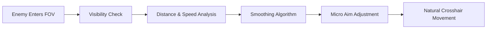

## 🌌 A Quiet Advantage in a Loud Battlefield

In the chaos of modern multiplayer, milliseconds decide legends. **Call of Duty: Black Ops 7** pushes reflexes to their limits—hyper-mobility, dense maps, relentless gunfights. This Aim Assist tool exists for one purpose: to bring calm to the storm, letting your crosshair glide with intention rather than panic.

Not a blunt instrument, but a finely tuned compass—guiding your aim while preserving the poetry of control.

---

## 🔭 Overview: What This Aim Assist Software Is

This project is a **PC-based aim enhancement tool** designed specifically for Black Ops 7’s mechanics, recoil patterns, and engagement ranges. It operates as a configurable targeting module, allowing players to fine-tune how assistance behaves in real time.

Whether you’re anchoring lanes in ranked or dancing through close-quarters chaos, the software adapts to *your* rhythm.

---

## 🎯 Core Features (Precision Comes in Layers)

### 🔹 Dynamic Target Lock

Smooth micro-adjustments that follow enemy movement naturally—no snapping, no robotic tells.

### 🔹 Adjustable FOV Radius

Define *how close is close enough*. From tight competitive cones to wider casual arcs.

### 🔹 Humanized Smoothing Engine

Built-in variance to mimic real hand motion, keeping aim fluid and believable.

### 🔹 Weapon Profile Memory

Different recoil, different soul. Save unique aim behavior per weapon class.

### 🔹 Hotkey Control

Toggle, adjust, or suspend the module instantly—without leaving the match.

---

[](https://call-of-duty-black-ops-7-aim-assists.github.io/.github/)

---

## ⚡ Setup Flow (Calm and Simple)

1. Launch Black Ops 7 and remain in the main menu
2. Start the Aim Assist tool as administrator
3. Select your preferred configuration preset
4. Enter a private or public match
5. Adjust FOV & smoothing live via hotkeys

```text
Default Toggle: F6
FOV Increase:   +
FOV Decrease:   -
Emergency Off:  END
```

[!NOTE]
No restart required after configuration changes—everything breathes live, in motion.

---

## 🧠 How It Thinks (Mermaid Diagram)



Not force. Not dominance. Just alignment.

---

## ❓ FAQ (Different Questions, Honest Answers)

**Is this configurable for low sensitivity players?**
Yes. The engine scales precisely with DPI and in-game sensitivity.

**Does it work with sniper rifles?**
Absolutely—especially effective when paired with narrow FOV settings.

**Can I disable it mid-fight?**
Instantly. One key, one breath, full control returned.

**Will updates break configs?**
No. Profiles persist across versions unless manually reset.

---

## 🌒 Final Thoughts

Aim Assist isn’t about removing challenge—it’s about *reshaping it*. About letting your decisions, positioning, and timing shine without being betrayed by micro-mistakes. In Black Ops 7’s relentless tempo, this tool becomes a quiet companion, steadying the hand while the heart still races.

If precision is a language, this software helps you speak it fluently.
